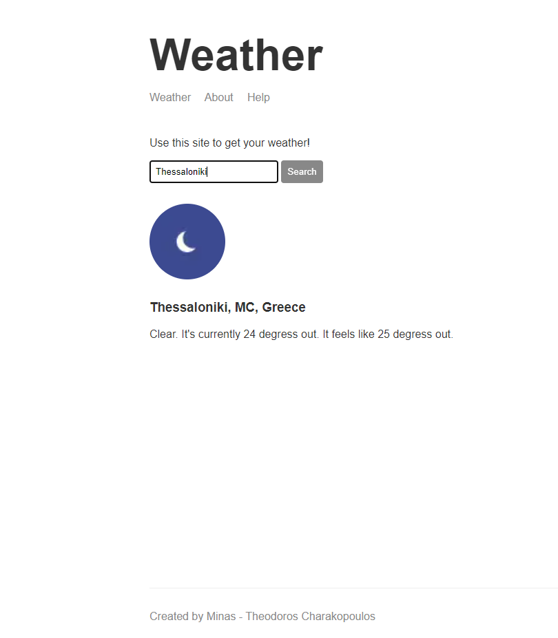

# WeatherApp
<h3>Simple weather website for the current time made using NodeJS framework</h3><br>


# Tools and services used
<ul>
<li><b>ExpressJS</b></li>
<li><b>Handlebars</b></li>
<li><b>Postman request</b> (request package)</li>
<li><b>Nodemon</b></li>
<li><b>Geolocation API</b></li>
<li><b>Fetch API</b></li>
<li><b>Weatherstack API</b> for the weather data. <i>250 Calls / mo for free subscription plan.</i><a href="https://weatherstack.com"> API info<a></li>
<li><b>Weatherstack API</b> for the location data. <i>25.000 Requests for free subscription plan.</i><a href="https://positionstack.com"> API info<a></li>
</ul>

<h4>!Maybe weather service not availabe because the limit of requests offered by the free APIs was exceeded!</h4>

# Local Installation
```
 git clone https://github.com/ics20072/WeatherApp
 Import WeatherApp folder to vscode
 cd WeatherApp
 npm install
 npm run start || npm run dev
 visit in browser http://localhost:3000
```
# Live
https://ics20072-weather-node-website.herokuapp.com
